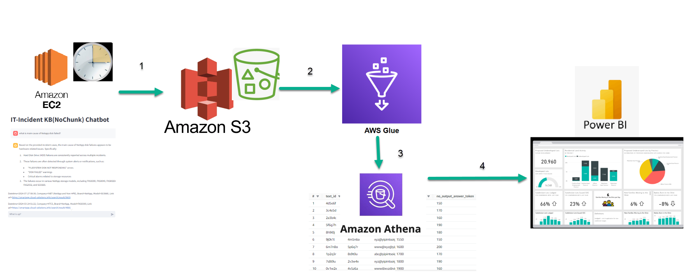
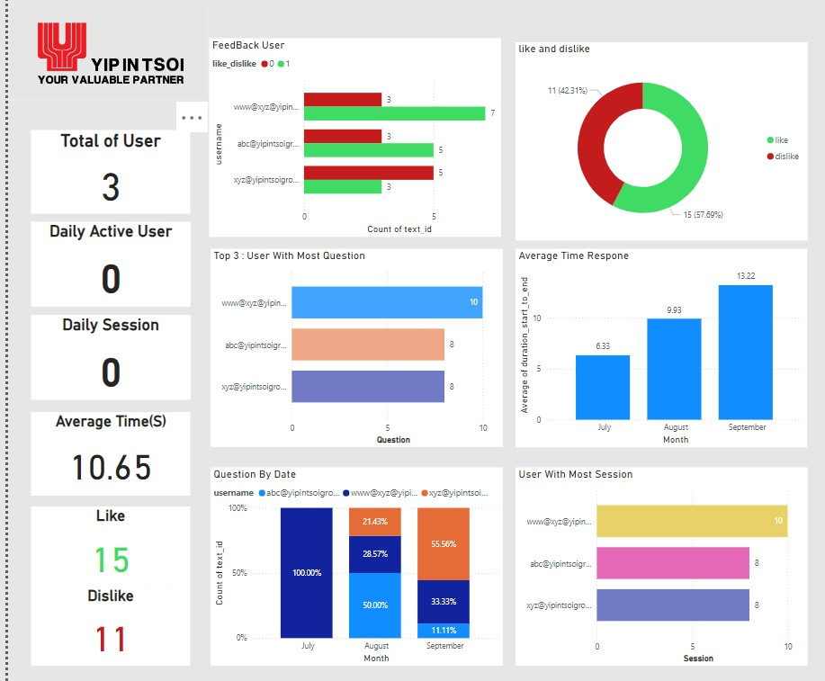

# Amazon Bedrock GenAI LLM Project
Implement Generative AI Project   such as Knowledge Base, Agent Base, Text Classification, Text Generation, Data/Document Extraction  on  AWS Platform : Amazon Bedrock, Langchain, Claude.ai ,llamaindex.ai , Vector Database (Pinecone,Open Search  Serverless, PGVector)

## Incident Knownledge Base and Anlytics

* Amazon Bedrock streamlines IT incident management by ingesting incident data, transforming user queries into embeddings, searching for relevant context in a VectorDB,augmenting  input query with additional context from the most relevant search result  ,and generating accurate responses using a reference model. 
* This workflow enables the IT-Incident KB Chatbot to provide efficient and contextually relevant answers to user questions which are historical incident cases  in order to streamline  the overall incident management process to fix any incident issues for customer efficiently.

The provided text describes a data processing pipeline for an IT-Incident Knowledge Base (KB) chatbot . The key steps in the pipeline are:

* The chatbot data originates from the IT-Incident KB.
* The data is transferred to Amazon S3 for storage.
* AWS Glue is used to process and transform the data.
* Amazon Athena is employed to query and analyze the data stored
* Power BI is used for analytics and reporting

## Incident Agent

The image illustrates the process of the Incident-Agent to orchestrate various tasks for IT Incident Manangement System including

* Retrieving Historical incident data from the knowledge base is retrieved to assist in resolving the incident.
* Fetching real-time incident data in order to updating the status, and adding incident details to the Agent toward the AWS Lambda function to database right away. 

## Incident Query & Reporting For User  By Natural Language to SQL Query Converter 
<image src="images/incidnet_text_to_sql.png">
This process demonstrates how a user can interact with a database using natural language queries, which are transformed into SQL queries behind the scenes to retrieve the desired data from the connected data sources.

* User inputs natural language query
* Amazon Bedrock and AWS Lambda convert query to SQL
* SQL query executed on AWS Glue Data Catalog, Athena, and RDS
* Query result returned in CSV format

## Incident Private KB ,General question and TextToSQL Report on Single Platform (Comming Soon)
Ref image : [amazon-bedrock-samples-knowledge-bases/use-case-examples](https://github.com/aws-samples/amazon-bedrock-samples/blob/main/knowledge-bases/use-case-examples/rag-using-structured-unstructured-data/image/Text2SQL-RAG.png)
<image src="images/KB_Text2SQL-RAG.png">

* The RAG Knowledgebase Amazon Bedrock is a tool that combines structured and unstructured data to answer questions using Retrieval Augmented Generation (RAG).
* It integrates a knowledge base and a database to retrieve relevant information and generate comprehensive natural language responses.
* The MultiRetrievalQAChain determines the appropriate data source for a given question, fetches relevant information, maintains conversation context, and synthesizes the retrieved data into a coherent natural language answer.
* This is the mixture of structured data from a database (retrieved using Text-to-SQL as a retriever) and unstructured data as text-based knowledge base from S3, SharePoint to power a RAG application.
* Prerequisites include creating a knowledge base for Amazon Bedrock using unstructured data and having data available for querying via SQL in Amazon Athena.

<image src="images/incident-multilchain.png">
## Document Extraction to Structure Data For Analystics.

It involved a process that uses a Large Language Model (LLM) Generative AI model to extract data from resumes in PDF format. Here's a breakdown of the process in bullet points:

* The process starts with unstructured data in PDF format being ingested. This could include resumes in various formats and styles.
* The LLM Generative AI model then extracts data from the PDF files.
* The extracted data is then stored in a structured format, like a JSON file. This allows for easier organization and analysis of the information.
* It's important to note that, It can be used to various kind of document such as resume, invoice billing, preventive maintenance document with varying layouts/pattern

## Incident Severity Level Classification (Comming Soon)

The image depicts a process for identifying severity level to respond to IT incidents. Here are the steps in the flowchart, broken down into bullet points:

* The process starts with an IT incident being opened. There are two options at this point:
* If Model classified as critical or major incident, then an alert 
* The possible severity levels are Critical ,Major ,Minor, Cosmetic
* Depending on the severity level of the incident, different actions are taken.

 
