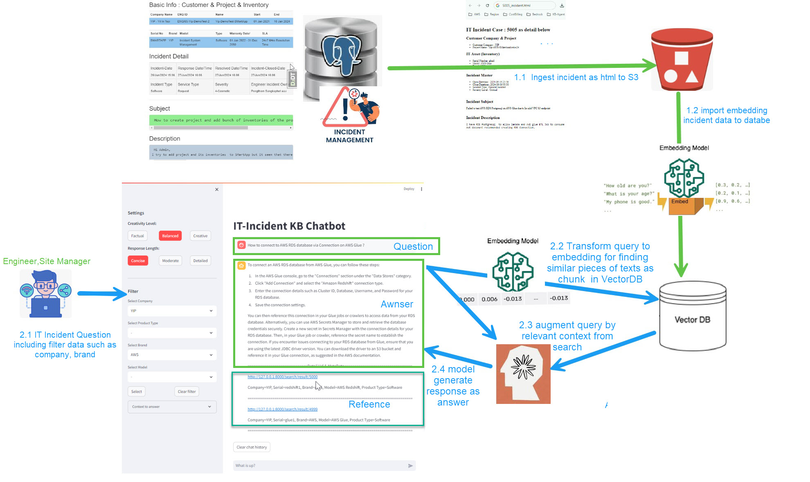
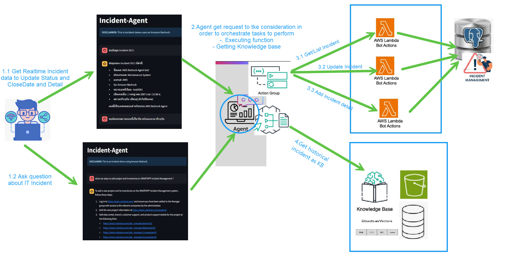
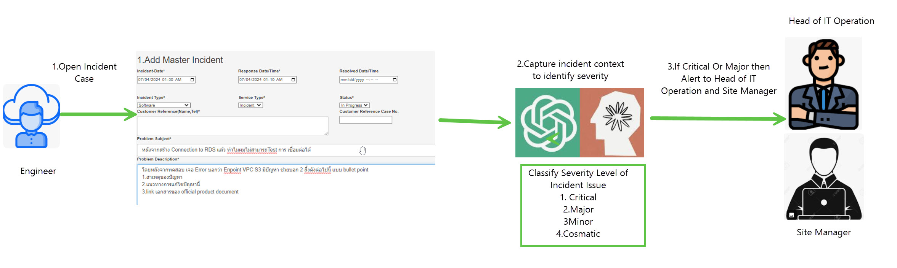

# Amazone Bedrock GenAI LLM Project
## Incident Knownledge Base

## Incident Agent

### Incident Severity Level Classification

The image depicts a process for identifying severity level to respond to IT incidents. Here are the steps in the flowchart, broken down into bullet points:

* The process starts with an IT incident being opened. There are two options at this point:
* If Model classified as critical or major incident, then an alert 
* The possible severity levels are Critical ,Major ,Minor, Cosmetic
* Depending on the severity level of the incident, different actions are taken.
 
### Data Extraction from Unstructure to Structure.
