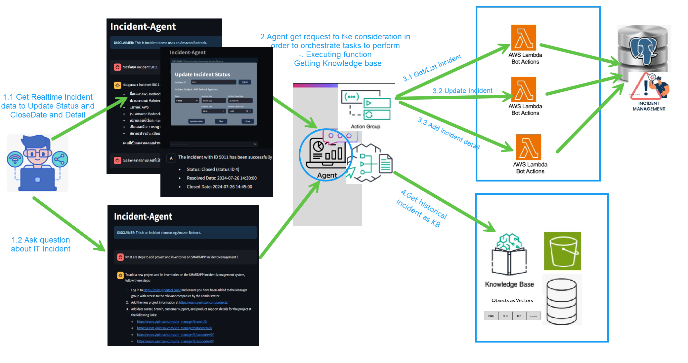

# Amazone Bedrock GenAI LLM Project
Implement Generative AI Project   such as Knowledge Base, Agent Base, Text Classification, Text Generation, Data/Document Extraction  on  AWS Platform : Amazon Bedrock, Langchain, Claude.ai ,llamaindex.ai , Vector Database (Pinecone,Open Search  Serverless, PGVector)

## Incident Knownledge Base

* Amazon Bedrock streamlines IT incident management by ingesting incident data, transforming user queries into embeddings, searching for relevant context in a VectorDB, and generating accurate responses using a reference model. 
* This workflow enables the IT-Incident KB Chatbot to provide efficient and contextually relevant answers to user questions which are historical incident cases  in order to streamline  the overall incident management process to fix any incident issues for customer efficiently.

## Incident Agent

The image illustrates the process of the Incident-Agent to orchestrate various tasks for IT Incident Manangement System including

* Retrieving Historical incident data from the knowledge base is retrieved to assist in resolving the incident.
* Fetching real-time incident data in order to updating the status, and adding incident details to the Agent toward the AWS Lambda function to database right away. 

## Document Extraction to Structure Data For Analystics.

It involved a process that uses a Large Language Model (LLM) Generative AI model to extract data from resumes in PDF format. Here's a breakdown of the process in bullet points:

* The process starts with unstructured data in PDF format being ingested. This could include resumes in various formats and styles.
* The LLM Generative AI model then extracts data from the PDF files.
* The extracted data is then stored in a structured format, like a JSON file. This allows for easier organization and analysis of the information.
* It's important to note that, It can be used to various kind of document such as resume, invoice billing, preventive maintenance document with varying layouts/pattern

## Incident Severity Level Classification (Comming Soon)

The image depicts a process for identifying severity level to respond to IT incidents. Here are the steps in the flowchart, broken down into bullet points:

* The process starts with an IT incident being opened. There are two options at this point:
* If Model classified as critical or major incident, then an alert 
* The possible severity levels are Critical ,Major ,Minor, Cosmetic
* Depending on the severity level of the incident, different actions are taken.

## Incident Query & Reporting  By Natural Language to SQL Query Converter (Comming Soon)

 
